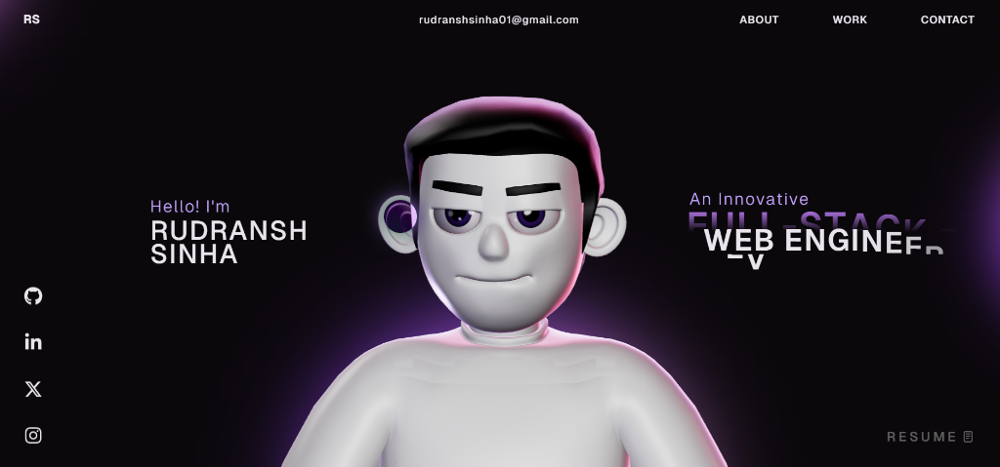

# Rudransh Sinha - 3D Interactive Portfolio



Welcome to the open-source repository for my personal 3D interactive portfolio. As a **Full-Stack Developer and AI Engineer**, I focus on building scalable, intelligent web solutions while delivering unparalleled, engaging user experiences. 

This portfolio demonstrates advanced web technologies using responsive layout techniques, seamless scrolling animations, and interactable fluid 3D models running completely in the browser.

## 🚀 Features

- **Interactive 3D Avatar**: An animated, responsive 3D character built using Three.js and React Three Fiber that follows the user's cursor interactions and scroll positioning.
- **Scroll Hijacking & Physics**: Fluid and cinematic scroll animations seamlessly choreographed using GSAP (ScrollTrigger & ScrollSmoother), mixed with real-time Rapier rigid-body physics for the interactive tech stack arena.
- **Modern UI Aesthetics**: High-quality dark mode styling with custom geometric layouts, dynamic hover text, and neon accents.
- **React suspense & lazy routing**: Optimized component chunking for near-instant Time-To-Interactive performance despite heavy graphics rendering.

## 🛠️ Built With

- **Framework**: React 18, Vite
- **Language**: TypeScript, JavaScript
- **3D Graphics**: Three.js, @react-three/fiber, @react-three/drei, @react-three/postprocessing
- **Physics**: @react-three/rapier
- **Animation**: GSAP (GreenSock Animation Platform)
- **Styling**: Vanilla CSS3, CSS Variables

## 💻 Included Projects

The portfolio natively highlights my featured development work:
1. **Student Management System** – A database-driven application engineered natively with Python and MySQL.
2. **Personal Portfolio Website** – This highly aesthetic 3D rendering project!
3. **Deloitte Job Sim Dashboard** – An analytical dashboard simulation built during professional development.

## ⚙️ Running Locally

Want to inspect the source code or run the 3D simulation on your local development machine? Ensure you have `Node.js` installed.

```bash
# Clone the repository
git clone https://github.com/Rudransh-Sinha/Updated-Portfolio.git

# Navigate into the project folder
cd Updated-Portfolio

# Install all necessary dependencies
npm install

# Start the Vite development server
npm run dev
```

The application will hot-load and serve on `http://localhost:5173`. 

## 📬 Let's Connect

- **Email**: rudranshsinha01@gmail.com
- **GitHub**: [Rudransh-Sinha](https://github.com/Rudransh-Sinha)
- **LinkedIn**: [rudranshsinha](https://www.linkedin.com/in/rudranshsinha/)
- **X (Twitter)**: [Rudransh_Sinha1](https://x.com/Rudransh_Sinha1)
- **Instagram**: [sinha_rudransh._01](https://www.instagram.com/sinha_rudransh._01)

---
*Designed & Developed by Rudransh Sinha*
